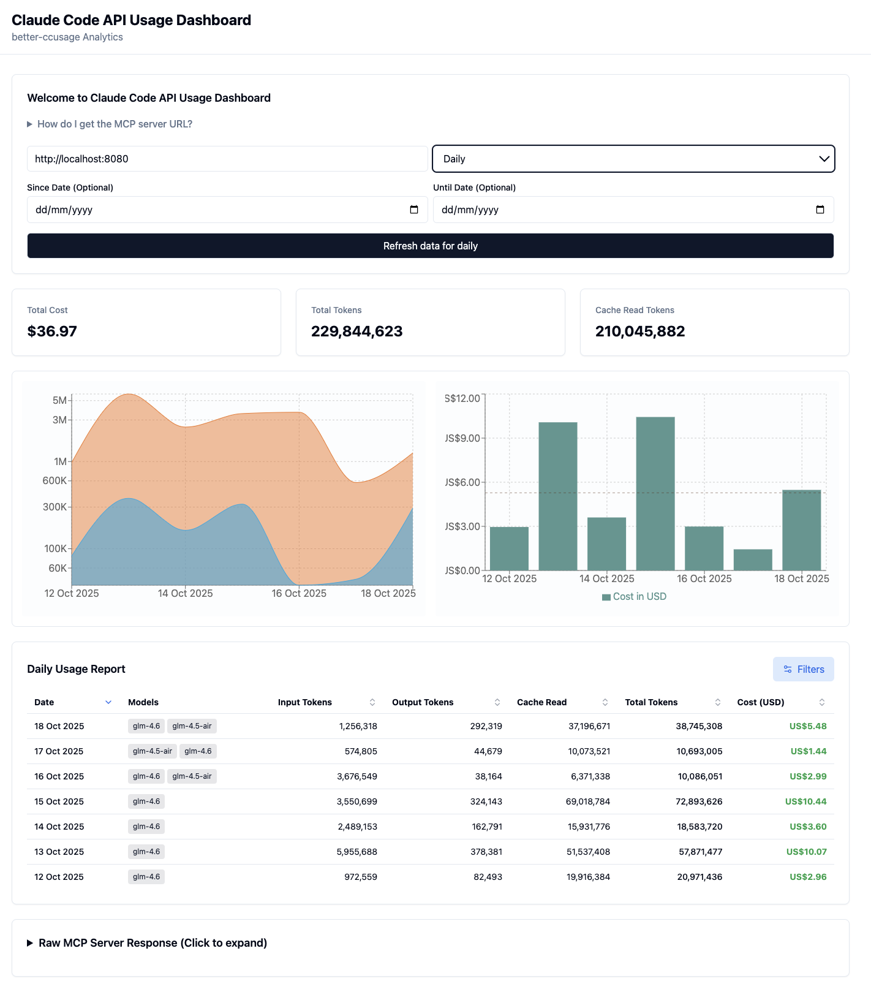

# better-ccusage-ui

Claude Code API Usage Dashboard - Interactive visualizations and analytics for better-ccusage JSONL data. Baed on [cobra91/better-ccusage](https://github.com/cobra91/better-ccusage)

## Overview

This is a **React-based monorepo application** that transforms better-ccusage JSONL output files into interactive visualizations and analytics. The project helps development teams monitor, analyze, and optimize their AI API usage across multiple providers (Anthropic, Zai, GLM-4.5/4.6) with real-time insights into token consumption, costs, and usage patterns.

## Prerequisites

- **Node.js**: v22.x (specified in `.nvmrc`)
- **Yarn**: v1.22.0 or higher
- **better-ccusage MCP Server**: Must be running to provide data

### Starting the MCP Server

Before running the application, start the better-ccusage MCP server:

```bash
npx @better-ccusage/mcp@latest --type http --port 8080
```

## Project Structure

This is a Yarn workspaces monorepo with three packages:

```
better-ccusage-ui/
├── frontend/          # React + Vite frontend application
├── backend/           # Express.js backend API
├── shared/            # Shared types and utilities
└── package.json       # Root workspace configuration
```

## Development

### Quick Start

```bash
# Use the specified Node.js version
nvm use

# Install dependencies
yarn

# Start both frontend and backend in development mode
yarn dev
```

This will start:
- **Frontend**: Vite dev server (typically http://localhost:5173)
- **Backend**: Express server with hot reload

### Individual Package Development

```bash
# Frontend only
cd frontend && yarn dev

# Backend only
cd backend && yarn dev
```

## Available Scripts

### Root Level Scripts

- `yarn dev` - Start both frontend and backend in development mode
- `yarn build` - Build all packages for production
- `yarn test` - Run tests across all workspaces
- `yarn test:watch` - Run tests in watch mode
- `yarn lint` - Lint all packages
- `yarn format` - Format code with Prettier
- `yarn type-check` - Type check all packages with TypeScript
- `yarn clean` - Remove all node_modules and build artifacts

### Frontend Scripts

```bash
cd frontend

yarn dev              # Start development server
yarn build            # Build for production
yarn preview          # Preview production build
yarn test             # Run tests
yarn test:ui          # Run tests with UI
yarn test:coverage    # Generate test coverage report
yarn lint             # Lint TypeScript/TSX files
yarn lint:fix         # Auto-fix linting issues
yarn storybook        # Start Storybook development server
yarn build-storybook  # Build Storybook for production
```

### Backend Scripts

```bash
cd backend

yarn dev          # Start development server with hot reload
yarn build        # Build for production
yarn start        # Start production server
yarn test         # Run tests
yarn test:watch   # Run tests in watch mode
yarn lint         # Lint TypeScript files
yarn lint:fix     # Auto-fix linting issues
```

## Tech Stack

### Frontend
- **Framework**: React 18 with TypeScript
- **Build Tool**: Vite 6
- **UI Components**: Radix UI primitives with custom styling
- **Styling**: Tailwind CSS
- **Icons**: Lucide React
- **State Management**: Zustand
- **Data Fetching**: TanStack Query (React Query)
- **Forms**: React Hook Form with Zod validation
- **Charts**: Chart.js & Recharts
- **Testing**: Vitest + React Testing Library
- **Component Development**: Storybook

### Backend
- **Runtime**: Node.js with TypeScript
- **Framework**: Express.js
- **Validation**: Zod
- **HTTP Client**: Axios
- **Security**: Helmet, CORS
- **Development**: tsx with watch mode
- **Testing**: Vitest + Supertest

### Shared
- Shared TypeScript types and utilities
- Common validation schemas
- Cross-package utilities

## Building for Production

```bash
# Build all packages
yarn build

# Build specific packages
cd frontend && yarn build
cd backend && yarn build
```

The frontend build output will be in `frontend/dist/` and backend in `backend/dist/`.

## Screenshots

Below is a screenshot of the frontend application:




## Testing

```bash
# Run all tests
yarn test

# Run tests in watch mode
yarn test:watch

# Run tests with coverage
cd frontend && yarn test:coverage
cd backend && yarn test:coverage
```

## Code Quality

This project uses several tools to maintain code quality:

- **ESLint**: Linting for TypeScript and React
- **Prettier**: Code formatting
- **Lint-staged**: Run linters on staged files
- **TypeScript**: Strict type checking

### Pre-commit Hooks

The project automatically runs the following on commit:
- ESLint with auto-fix
- Prettier formatting
- Type checking

## Configuration Files

- `.nvmrc` - Node.js version specification
- `.prettierrc` - Prettier configuration
- `.prettierignore` - Files to exclude from formatting
- `tsconfig.json` - TypeScript configuration (root and per package)
- `tailwind.config.js` - Tailwind CSS configuration
- `vite.config.ts` - Vite configuration (frontend)
- `.eslintrc.cjs` - ESLint configuration (per package)

## Example API Usage

Test the MCP server connection:

```bash
# Get blocks usage data
curl -X POST http://localhost:8080 \
  -H "Content-Type: application/json" \
  -H "Accept: application/json, text/event-stream" \
  -d '{"jsonrpc":"2.0","id":1,"method":"tools/call","params":{"name":"blocks","arguments":{}}}'

# Get daily usage data
curl -X POST http://localhost:8080 \
  -H "Content-Type: application/json" \
  -H "Accept: application/json, text/event-stream" \
  -d '{"jsonrpc":"2.0","id":1,"method":"tools/call","params":{"name":"daily","arguments":{}}}'
```

## Troubleshooting

### Port Already in Use

If the development servers fail to start due to port conflicts:
- Frontend default: 5173 (configurable in `vite.config.ts`)
- Backend default: Check `backend/src/index.ts` for port configuration
- MCP Server: 8080 (as specified in prerequisites)

### Node Version Mismatch

Ensure you're using Node.js v22.x:
```bash
nvm use
node --version  # Should show v22.x
```

### MCP Server Not Running

If the application cannot connect to the MCP server:
1. Verify the server is running on port 8080
2. Check the server configuration in the frontend application
3. Review network/firewall settings

## License

This project is released into the public domain.
You are free to use, modify, distribute, and build upon this software for any purpose, without restriction.

No attribution required. No warranty provided.

# Contributing

Thank you for your interest in contributing! 🎉

Please follow the common open-source contribution guidelines:

* Fork the repository and create a new branch for your change.
* Make clear, focused commits with descriptive messages.
* Ensure your code follows existing style and passes tests.
* Submit a pull request with a clear explanation of your changes.

By contributing, you agree that your work will be licensed under the same license as this project.

### Special Thanks

Special thanks to [cobra91/better-ccusage](https://github.com/cobra91/better-ccusage) for inspiration and reference.
